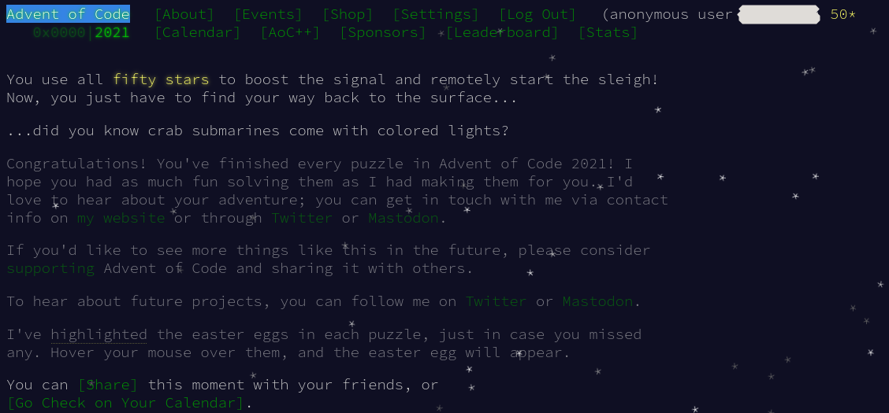

# Advent of Code 2021

Way back in June I though that I'd try an old Advent of Code. This was partly
as a way of trying out Rust.

I finished today and - having watched some people finish this years Advent
of Code in the allotted time, I am filled with admiration for those who
managed it. I haven't really been giving the older competition my full
attention but TBH I doubt that I could have managed to complete it on
time anyway.

It's been an interesting journey. I have enjoyed using Rust! Efficient
Hash Maps and Hash Sets have been a lot of help and - if I'd coded in
C I would have had to do more work or think about things differently.

If you are familiar with idiomatic Rust then I expect that my code will
look more like _C written in Rust_

I don't think that it's possible to get good at a language without using
it for your day job. Given my current occupation, I can't see that ever
happening. We have C where I work. A _lot_ of C.

I've programmed C since the 1980's. Rust feels like a natural successor.

